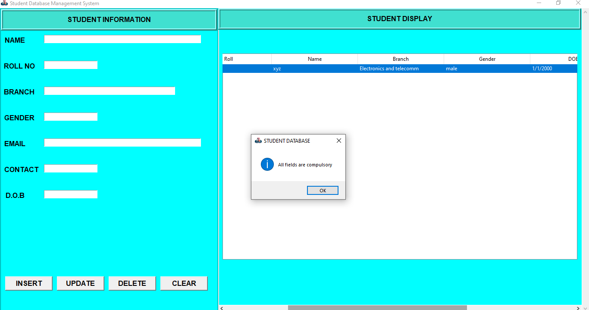

# Student database management system. 🪔
> Welcome viewers 🙂

This project is basically a student management system and can be used to Store , update , read , or delete students records. All these operations are performed by backend code
in connection with a database. The frontend code provides an awesome  'graphical user interface' to access the students records and to manage them without bothering about other technicalities.
#### Languages and Tools used 🔧 :
- Python.
- sqlite.
- pycharm.
- sqlite browser.
## Installing 💾 

#### Install python according to your operating system.
[Python Download](https://www.python.org/downloads/)
#### You can use any IDE (I personally use Pycharm for this project.)
[Pycharm download](https://www.jetbrains.com/pycharm/download/#section=windows)
#### Install sqlite browser according to your operating system.
[sqlite browser download](https://sqlitebrowser.org/dl/)
#### Install git according to your operating system.
[Git download](https://git-scm.com/downloads)

## Getting started 😄 📑
- First install all the essentials mentioned above.
- Open your git bash terminal and copy paste below code.
  ```
  cd name_of_folder_to_copy
  git clone https://github.com/Thunderbolt9/Student-Management-system.git
  ```
  - The above line of code first opens a folder you want and then clone the files of this repository into the folder.

- Now open those files in your favourite IDE.
- Now you have create a database with the same name as mentioned in backend code i.e 'studentrecord'.
  - You an add below code to backend.py file to create a database.
    ```
    # Connecting to sqlite
    conn = sqlite3.connect('studentrecord.db')
    # Creating a cursor object using the cursor() method
    cursor = conn.cursor()
    # Creating table as per requirement
    sql ='''CREATE TABLE studentrecord(
      id	INTEGER,
	  PRIMARY KEY(id),
      StdID text,
      Name text,
      Branch text,
      Gender text,
      DoB text,
      Mobile text,
      Email text
    )'''
    # Creating table as per requirement
    cursor.execute(sql)
    print("Table created successfully........")
    # Commit your changes in the database
    conn.commit()
    # Closing the connection
    conn.close()
    ```
  - Or you can create database with name 'studentrecord' directly from sqlite browser. [Refer](https://youtu.be/YLOZpYAYPLQ)
- Note keep all the files in same folder.
- Also download the logo given in repo and keep in same folder.
  ```
  root.iconbitmap(r'logo.ico')
  ```
  - Here you need that logo in fronend.py file.
  - If you want your own logo then store that in same folder and just change name of file in above code.

## Output 💻



## Contributing

When you publish something open source, one of the greatest motivations is that
anyone can just jump in and start contributing to your project.

These paragraphs are meant to welcome those kind souls to feel that they are
needed. You should state something like:

"If you'd like to contribute, please fork the repository and use a feature
branch. Pull requests are warmly welcome."

If there's anything else the developer needs to know (e.g. the code style
guide), you should link it here. If there's a lot of things to take into
consideration, it is common to separate this section to its own file called
`CONTRIBUTING.md` (or similar). If so, you should say that it exists here.

## Links

Even though this information can be found inside the project on machine-readable
format like in a .json file, it's good to include a summary of most useful
links to humans using your project. You can include links like:

- Project homepage: https://your.github.com/awesome-project/
- Repository: https://github.com/your/awesome-project/
- Issue tracker: https://github.com/your/awesome-project/issues
  - In case of sensitive bugs like security vulnerabilities, please contact
    my@email.com directly instead of using issue tracker. We value your effort
    to improve the security and privacy of this project!
- Related projects:
  - Your other project: https://github.com/your/other-project/
  - Someone else's project: https://github.com/someones/awesome-project/


## Licensing

One really important part: Give your project a proper license. Here you should
state what the license is and how to find the text version of the license.
Something like:

"The code in this project is licensed under MIT license."
